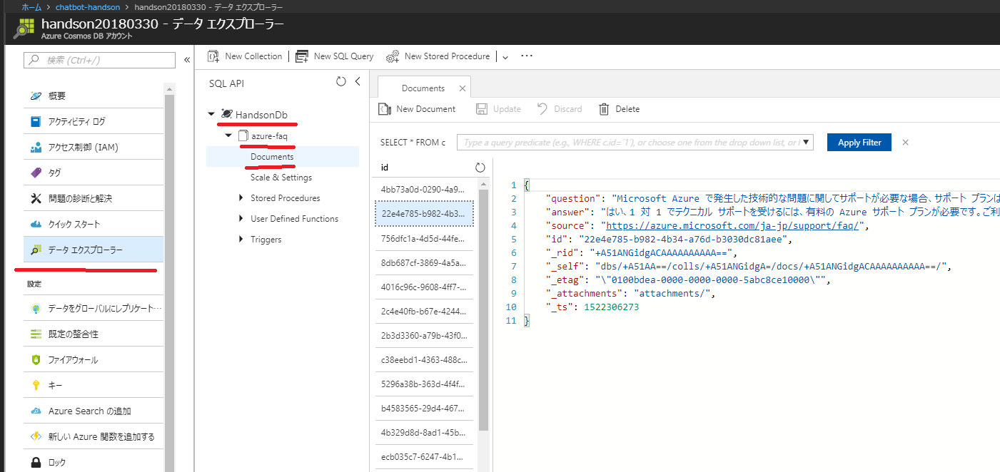

# 01. Cosmos DB へFAQデータをインポート

Azure Search の検索データソースとなる Cosmos DB を作成し、データをインポートします。
インポートするデータは、Azureに関する質問と回答のペア47件です。

## Cosmos DB の作成

Azure ポータルで、左上の方にある **リソースの作成** をクリックし、「cosmos db」を検索して作成をします。各種の入力は、以下を参考にします。

- **ID**: 任意の名称を入力
- **API**: 「SQL」を選択
- **サブスクリプション**: 今回利用するサブスクリプションを選択。
- **リソースグループ**: ハンズオン用に事前に作ったリソースグループを選択
- **場所**: リソースグループと同じ場所

## Colleciton の作成

Azure ポータルで、作成した Cosmos DB のリソースを開き、**概要** > **コレクションの追加** をクリックします。各種の入力は、以下を参考にします。

- **Database id**: 任意のデータベース名を入力
- **Collection id**: 今回利用するサブスクリプションを選択
- **Storage capacity**: デフォルト
- **Throughput**: 最低値（400）を設定

 

## データのインポート

この GitHub のレポジトリにある resources フォルダ内の **azure-faq.json** のデータを Cosmos DB にインポートします。

データのインポートには、事前の準備で紹介した「データ移行ツール」を利用します。ダウンロードした「データ移行ツール」のフォルダにある **dtuui.exe** から起動できます。

ツールを使ったインポート方法は、以下をご参照ください。

[Azure Cosmos DB: データ移行ツール](https://docs.microsoft.com/ja-jp/azure/cosmos-db/import-data)

> **注意:** CosmosDB にデータをインポートする際に入力する Connection String には、Azure ポータルから取得する Cosmos DB の接続文字列の後に `database=<dabase id>` が必要です。

## データの確認

データが正しくインポートされたかを確認します。

Azure ポータルで、作成した Cosmos DB のリソースを開き、**データエクスプローラー** >　作成したデータベース名 > Collection 名 > **DOcuments** をクリックし、データが入っていることを確認しましょう。

 

47件のデータ入っているとこのワークは完了です。

**New SQL Query** をクリックし、クエリーに `select count(c.id) from c` を入力して実行すると件数を簡易に確認することができます。

---

[Back](00_Preparation.md) | [Next](02_Create_AzureSearch.md)