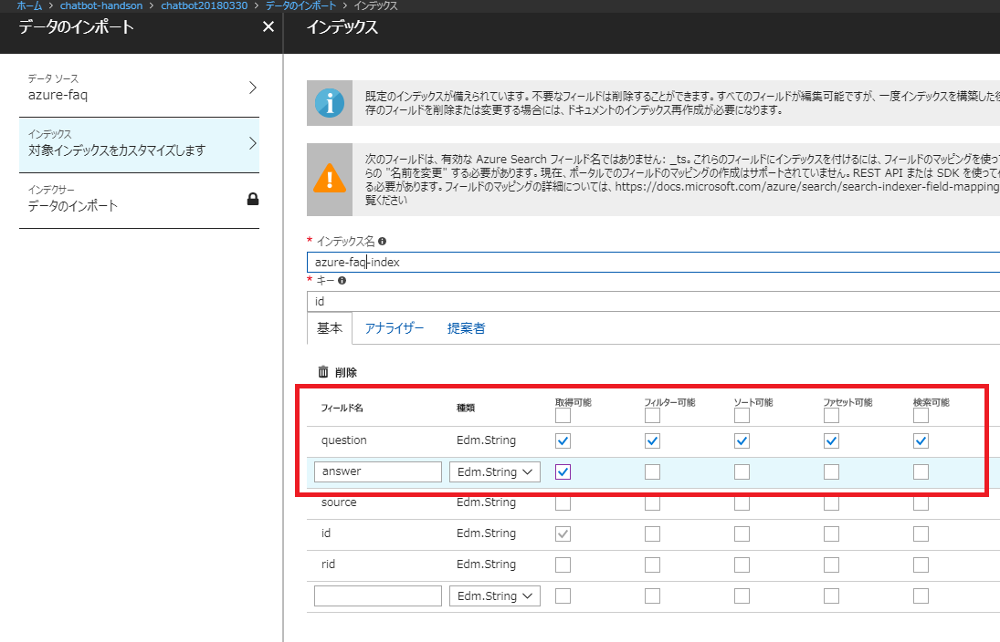
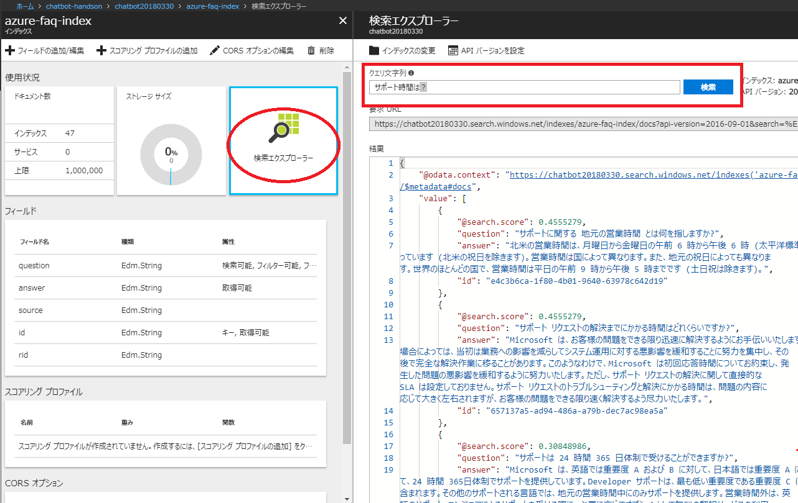

# 02. Azure Search の作成

Cosmos DB のデータは、Azure 質問と回答のペアが格納されています。
検索によって、質問のデータの関連性が高い回答を取得できる Azure Search を構築します。

## Azure Search の作成

Azure ポータルの左上にある **リソースの作成** をクリックし、「Azure Search」を検索して作成をします。作成時に各種の入力項目は、以下を参考にします。

- **URL**: 任意の名称を入力
- **サブスクリプション**: 今回利用するサブスクリプションを選択
- **リソースグループ**: ハンズオン用に事前に作ったリソースグループを選択
- **場所**: リソースグループと同じ場所
- **価格レベル**: Free を選択

## インデックスの作成

Azure ポータルで、作成した Azure Search のリソースを開き、**概要** > **データのインポート** をクリックします。作成時に各種の入力項目は、以下を参考にします。

- **データソース**: Cosmos DB
  - **名前**: 任意の名称入力
  - **Cosmos DB アカウント**: 先ほど作成した Cosmos DB のアカウントを選択
  - **データベース**: 先ほど作成したデータベースを選択
  - **コレクション**: 先ほど作成したコレクションを選択
  - **クエリ**: 入力なし

- **インデックス**:
  - **インデックス名**: 任意の名称を入力
  - **基本**: 以下のように設定します。
   

- **インデクサー**:
  - **名前**: 任意の名称を入力
  - **スケジュール**: 「1度」

**OK** をクリックすると、インデックスが作成されます。

## 検索の動作確認

Azure ポータルで、作成した Azure Search のリソースを開き、**概要** > **インデックス** 内にある作成したインデックスをクリックします。

表示された画面で **検索エクスプローラー** をクリックし、検索したいワードを使って検索を行うことができます。

Azure Search の検索は、単純なテキスト検索ではなく、文章を解析して関連性の高いものを取得することができます（[詳しくはこちら](https://docs.microsoft.com/ja-jp/azure/search/search-lucene-query-architecture)）。

---

[Back](01_Create_CosmosDb.md) | [Next](03_Create_AzureBotService.md)