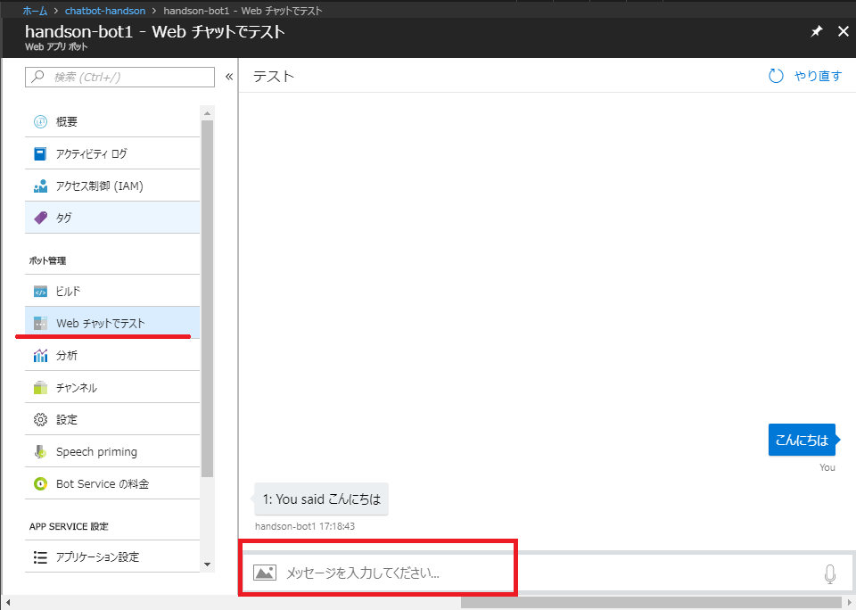

# 03. Azure Bot Service の作成

> ### 注意: 当コンテンツは、Bot Builder v3.14 をベースに作られています。
>
> ### 2018 年 9 月より GA した Bot Builder V4 と互換はありません。利用する Bot Builde バージョンにはご注意ください。

Bot Framework (C#)をベースに作られ、Azure 上にホストする Azure Bot Service を作成します。

## Web App Bot の作成

Azure ポータルの左上にある **リソースの作成** をクリックし、「Web app bot」を検索して作成をします。作成時に各種の入力項目は、以下を参考にします。

- **ボット名**: 任意の名称を入力
- **サブスクリプション**: 今回利用するサブスクリプションを選択
- **リソースグループ**: ハンズオン用に事前に作ったリソースグループを選択
- **場所**: リソースグループと同じ場所
- **アプリ名**: 任意の名称を入力
- **ボットテンプレート**: Basic（C#）
- **App Service プラン/場所**: 任意のリソース（新規作成時は料金プランはフリーがあります）
- **Azure Storage**: 任意のリソース（新規作成で問題なし）
- **Application Insights**: オン
- **Application Insights の場所**: 任意の場所
- **Microsoft アプリ ID とパスワード**: アプリ ID とパスワードの自動作成

## 動作確認

Azure ポータルで、作成した Web アプリ ボット のリソースを開き、**WEb チャットでテスト** からチャットボットの動作を確認することができます。文字を入力してみましょう。

今回は、Web App Bot 作成時にボットテンプレート「Basic（C#）」を選択しているため、入力した値をエコーするボットになっています。

## ソースコードのダウンロード

次のワークショップの準備として、生成されたプログラムをダウンロードします。

Azure ポータルで、作成した Web アプリ ボット のリソースを開き、**ビルド** を開いて、「ソースコードをダウンロード」にあるリンクから zip ファイルをダウンロードします。
ダウンロードが完了したら、zip を展開しましょう。

[Back](02_Create_AzureSearch.md) | [Next](04_Debug_EchoBot.md)
