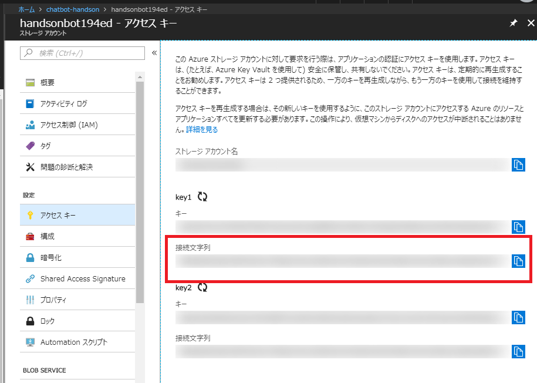
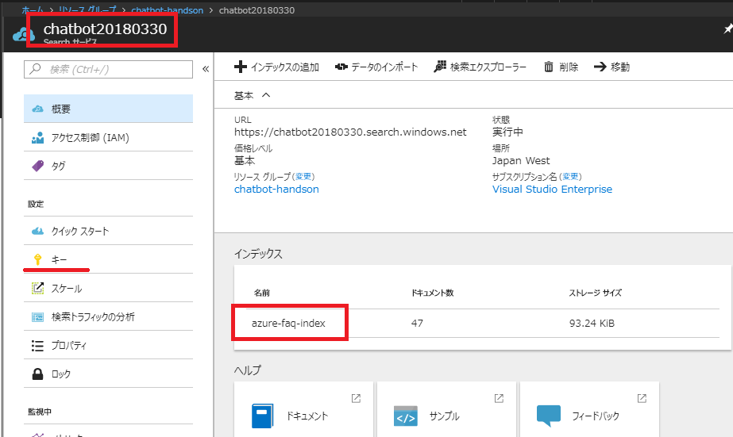
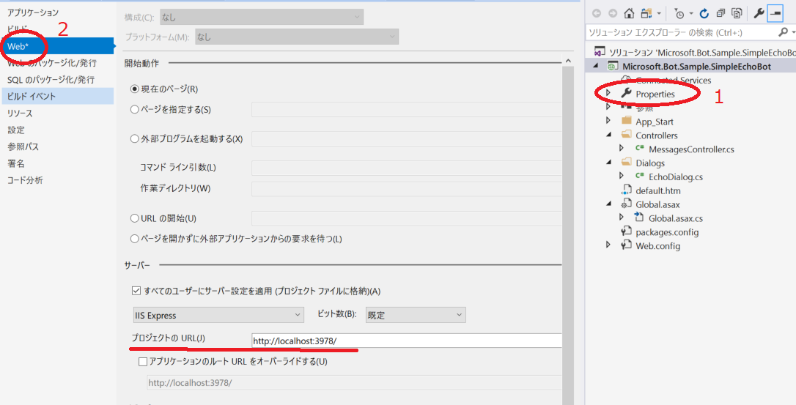
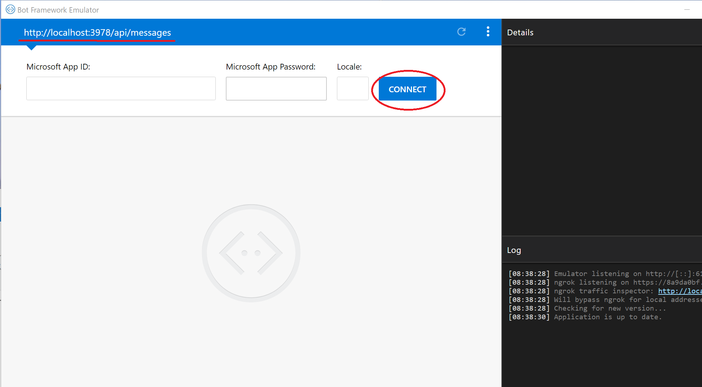
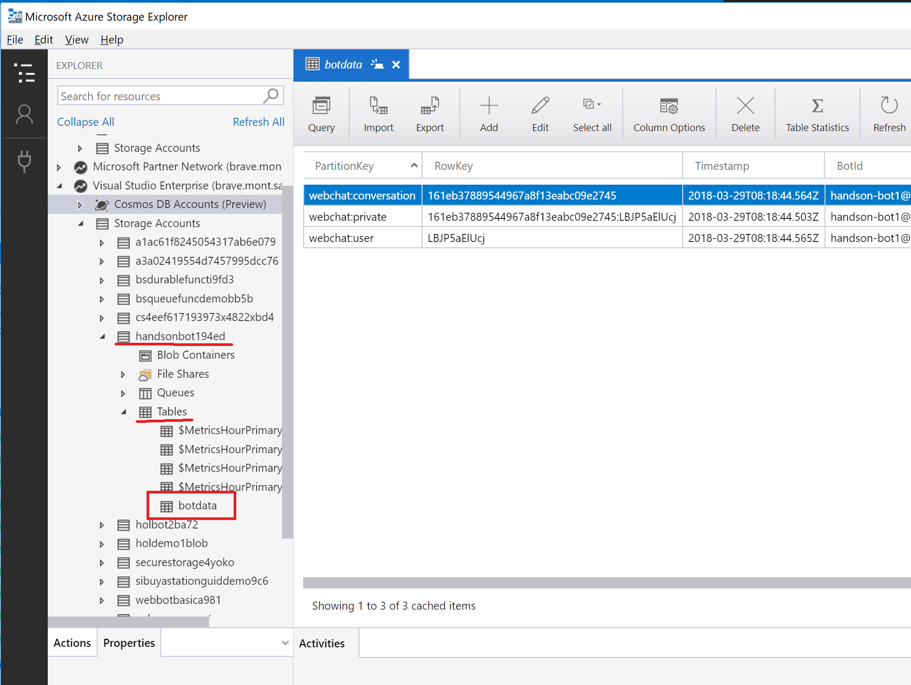

# 04. エコーボットをデバッグ実行

前のワークショップで生成されたエコーを返すチャットボットのプログラムを解説しながら、デバッグで動作確認できるようにプログラムを更新します。

## ダウンロードしたソースコードの概要

前のワークショップでダウンロードしたソースコードを Visual Studio 2017 で開きましょう。

Bot Framework で生成されたチャットボットのベースは、ASP.NET です。ここでASP.NET について詳しく述べませんが、簡単に全体構成を説明します。

- **MessageController クラス:** `Post` メソッドがリクエストを受け、レスポンスを返します。受け取ったリクエストの内容を `EchoDialog` クラスで処理します。
- **EchoDialog クラス:** ユーザーからのチャットのメッセージを待機してエコーを返す動作は、このクラスで行われます。

## Web Config の設定

デバッグで動作するためと、次のワークショップでの準備を兼ね、以下2点を設定します。

- Bot State の保存先として、Azure Storageの接続文字列を設定（Bot State についての詳細は[こちら](https://docs.microsoft.com/ja-jp/azure/bot-service/dotnet/bot-builder-dotnet-state)）
- Azure Search の接続に関する情報を設定

### Bot State の保存先を設定

`Globl.asax` を開いてみてみましょう。26行目のコードは、Bot State を Azure Storage (Table) に保存するためのものです。その接続文字列を環境変数（デバッグ時だとWeb.configから取得）から取得しています。

```cs
// Global.asax - 26行目: WebApiApplication クラス > Application_Start メソッド
var store = new TableBotDataStore(ConfigurationManager.AppSettings["AzureWebJobsStorage"]);
```

> (Bot State の保存先としてInMemoryやCosmosDBへの保存パターンがコメントアウトされていますが、今回は Azure Storage に保存する方法で進めます。)

このコードで接続文字列が取得できるように、Web.configで設定を行います。

#### Azure Storage の接続文字列の取得

Azure Storage は、Web App Bot を作成した際に生成したものを使います。Azure ポータル で作成したリソースグループに Azure Storage がありますので開きましょう。
**アクセスキー** をクリックして、**接続文字列**を取得できます。

 

#### Web.config に Azure Storage の接続文字列を設定

Visual Studio で、`Web.config` を開き、`AzureWebJobsStorage` というキーに対する値に Azure Storage の接続文字列を設定します。

```xml
<?xml version="1.0" encoding="utf-8"?>
<!--
  For more information on how to configure your ASP.NET application, please visit
  http://go.microsoft.com/fwlink/?LinkId=301879
  -->
<configuration>
  <configSections>
    <!-- For more information on Entity Framework configuration, visit http://go.microsoft.com/fwlink/?LinkID=237468 -->
    <section name="entityFramework" type="System.Data.Entity.Internal.ConfigFile.EntityFrameworkSection, EntityFramework, Version=6.0.0.0, Culture=neutral, PublicKeyToken=b77a5c561934e089" requirePermission="false" />
  </configSections>
  <appSettings>
    <!-- update these with your Microsoft App Id and your Microsoft App Password-->
    <add key="MicrosoftAppId" value="" />
    <add key="MicrosoftAppPassword" value="" />

    <add key="AzureWebJobsStorage" value="{接続文字列を入力}" />  <!-- この行を追加！ -->


  </appSettings>

<!-- 以下略 -->
```

### Azure Search の接続文字列の設定

Bot State 同様に、Azure ポータルから Azure Search の情報を取得して、`Web.config` に設定していきます。以下、3つのキーを `Web.config` に設定する前提で進めます。

- `SearchServiceName` : Azure Searchのサービス名
- `SearchIndexName` : Azure Serach のインデックス名
- `SearchServiceKey` : Azure Serach のキー

#### Azure Search の接続文字列の取得

3つの値を Azure ポータルから取得します。Auzre ポータルにて Azure Search のリソース > **概要** を開くと、左上部にAzure Searchのサービス名、画面中央あたりにインデックス名が確認できます。

以下図だと、サービス名は「chatbot20180330」、インデックス名は「azure-faq-index」となります。

キー（`SearchServiceKey` の値）は、**キー** を開いて確認することができます。

 

#### Web.config に Azure Search の接続文字列を設定

Visual Studio で、`Web.config` を開き、`appSettings` セクション内に以下のように3つのキーを追加します。value には、先ほど取得した値を設定します。


```xml
<?xml version="1.0" encoding="utf-8"?>
<!--
  For more information on how to configure your ASP.NET application, please visit
  http://go.microsoft.com/fwlink/?LinkId=301879
  -->
<configuration>
  <configSections>
    <!-- For more information on Entity Framework configuration, visit http://go.microsoft.com/fwlink/?LinkID=237468 -->
    <section name="entityFramework" type="System.Data.Entity.Internal.ConfigFile.EntityFrameworkSection, EntityFramework, Version=6.0.0.0, Culture=neutral, PublicKeyToken=b77a5c561934e089" requirePermission="false" />
  </configSections>
  <appSettings>
    <!-- update these with your Microsoft App Id and your Microsoft App Password-->
    <add key="MicrosoftAppId" value="" />
    <add key="MicrosoftAppPassword" value="" />

    <add key="AzureWebJobsStorage" value="{接続文字列を入力}" />

    <add key="SearchServiceName" value="{Azure Searchのサービス名を入力}" />　<!-- この行を追加！ -->
    <add key="SearchIndexName" value="{Azure Searchインデックス名を入力}" />　<!-- この行を追加！ -->
    <add key="SearchServiceKey" value="{Azure Searchキーを入力}" />　<!-- この行を追加！ -->

  </appSettings>

<!-- 以下略 -->
```


## デバッグにて動作確認

ここで、Bot State の正しく設定ができているかをデバッグで確認してみましょう。

### エミュレーターでチャットボットにアクセス

事前の準備で用意した Emulator を使い、チャットボットの動作を確認します。

まず、デバッグ実行時のアドレスを事前に確認します。Visual Studio で、以下図のようにプロジェクトのプロパティ > Web を開くと、**プロジェクトのURL** が確認できます。

 

今回のソースコードでは、`http://localhost:3978/` なので、デバッグでアクセスするURLは、以下となります。

```html
http://localhost:3978/api/messages
```

> （なぜこうなるかは、ASP.NET のルーティングと既存のコードの設定のためですが、ここで詳細の説明は省きます。）

#### デバッグの実行

次に、Visual Studio で（F5キーをクリック、または [デバッグ] > [デバッグの開始]等で）デバッグを開始しましょう。

#### Emulator で話しかける

Bot Framework Emulator で先ほど確認したアドレスを入力して、**CONNECT** をクリックして接続します。
適当な文字を入力して、エコーが返ってくるか試してみましょう。

 

### Azure Storage Explorer で Bot State を確認

Azure Storage に Bot State が更新されているか確認します。
Azure Storage Explorer を起動して、接続文字列を設定した Storage の Tables を見てみましょう。

`handsonbot194ed` という Storage を設定した場合、以下図のように、`handsonbot194ed` > `Tables` に `botdata` というテーブルが生成されていれば正常です。

 


---

[Back](03_Create_AzureBotService.md) | [Next](05_Implement_Search.md)
