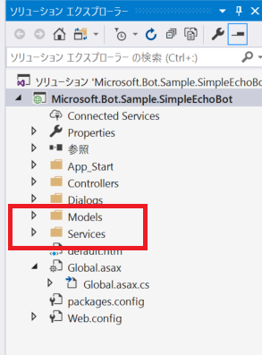

# 05. Azure Search で検索するチャットボットの実装

Azure Search で検索するためのプログラムを実装します。

## Nuget パッケージの取得

Azure Search を呼び出すための Nuget パッケージがありますのでインストールします。

Visual Studio で 上部のメニューから **ツール** > **Nuget パッケージ マネージャー** > **パッケージ マネージャー コンソール** をクリックします。パッケージ マネージャー コンソールが起動したら以下のコマンドをたたいてインストールしましょう。

```cs
 Install-Package Microsoft.Azure.Search
```

パッケージ マネージャー コンソールで正常にインストールされたメッセージが確認できれば完了です。

## フォルダーの作成

この後作成するクラスのために、事前にフォルダーを作成します。プロジェクト名（Microsoft.Bot.Sample.SimpleEchoBot）を右クリック > **追加** > **新しいフォルダー** をクリックし、以下2つのフォルダーを作成します。

- `Models`
- `Services`

 

## Model の作成

今回のプログラムでは、検索結果として Cosmos DB に格納されている質問と回答のペアを取得します。ここでは、質問と回答のペアのいれものを作成します。

`Models` フォルダーを右クリック > **追加** > **クラス** をクリックし、`FaqSearchResult` という名称のクラスを追加します。実装は以下の通りです。

```cs
using Microsoft.Azure.Search.Models;

namespace SimpleEchoBot.Models
{
    [SerializePropertyNamesAsCamelCase]
    public class FaqSearchResult
    {
        public string Question { get; set; }
        public string Answer { get; set; }
        public string Id { get; set; }
    }
}
```

今回の Cosmos DB は、Json フォーマットありで、今回はキャメルケースで格納しています。C# のプロパティにおける基本的な命名規約はパスカルケースのため、そのギャップを埋めるのに 
`SerializePropertyNamesAsCamelCase` アトリビュートを利用しています。


## Interface の作成

今回のシンプルなコードではあまり意味を持ちませんが、簡易な Interface を実装します。`Services` フォルダーを右クリック > **追加** > **クラス** をクリックし、`ISearchService` という名称のクラスを追加します( **追加** > **新しい項目** > **インターフェース** というオペレーションで進んでも構いません)。

実装は以下の通りです。

```cs
using Microsoft.Azure.Search.Models;
using SimpleEchoBot.Models;
using System.Collections.Generic;
using System.Threading.Tasks;

namespace SimpleEchoBot.Services
{
    public interface ISearchService
    {
        Task<IList<SearchResult<FaqSearchResult>>> SearchAsync(string searchText);
    }
}
```


## Service の作成

Azure Search で検索をして、検索結果を取得するプログラムを作ります。`Services` フォルダーを右クリック > **追加** > **クラス** をクリックし、`ISearchService` という名称のクラスを追加します。実装は以下の通りです。


```cs
using Microsoft.Azure.Search;
using Microsoft.Azure.Search.Models;
using SimpleEchoBot.Models;
using System.Collections.Generic;
using System.Configuration;
using System.Threading.Tasks;

namespace SimpleEchoBot.Services
{
    // 注意：処理の流れを理解してもらうために、あえて最適ではないが可視化しやすくするためのコードを実装しています。
    public class SearchService : ISearchService
    {
        private static readonly string SearchServiceName = ConfigurationManager.AppSettings["SearchServiceName"];
        private static readonly string IndexName = ConfigurationManager.AppSettings["SearchIndexName"];
        private static readonly string   SearchAdminKey= ConfigurationManager.AppSettings["SearchServiceKey"];
        private static readonly string[] Fields = { "question", "answer", "id" };

        private static readonly ISearchServiceClient SearchClient = new SearchServiceClient(SearchServiceName, new SearchCredentials(SearchAdminKey));
        private readonly ISearchIndexClient _searchIndexClient;


        public SearchService()
        {
            _searchIndexClient = SearchClient.Indexes.GetClient(IndexName);
            _searchIndexClient.AcceptLanguage = "ja-JP";
        }


        public async Task<IList<SearchResult<FaqSearchResult>>> SearchAsync(string searchText)
        {
            var searchParams = new SearchParameters
            {
                Select = Fields,
                Top = 3
            };

            var result = await _searchIndexClient.Documents.SearchAsync<FaqSearchResult>(searchText, searchParams);
            return result.Results;
        }
    }
}
```

コードを簡単に解説します。

static な変数についは主に、

- `Web.config` から Azure Search の設定情報を取得
- Azure Search と接続するためのクライアント(`ISearchServiceClient` 型)を初期化

を行っています。この部分は、DI をすることでより実践的なコードにすべきところですが、今回は行っておりません。

コンストラクターでは、検索するためのクライアント(`ISearchIndexClient`) を初期化しています。

`SearchAsync` メソッドでは、どのように検索するかを `SearchParameters` クラスで定義して、`SearchAsync` を使って検索し、結果を取得しています。

ここではシンプルな検索をしているだけですが、Azure Search には様々なオプションがありますので、実践的に利用する際には [ドキュメント](https://docs.microsoft.com/ja-jp/azure/search/search-howto-dotnet-sdk)を確認して最適な方法を模索すると良いでしょう。

## EchoDialog から Azure Search を呼び出す

`SearchService` クラスをインスタンス化して、`SearchAsync` メソッドを呼び出してみます。その際、Bot Framework Emulator で入力した文字を検索するようにします。

実装は、`EchoDialog` クラスを以下のように編集します。

```cs
using Microsoft.Bot.Builder.Dialogs;
using Microsoft.Bot.Connector;
using Newtonsoft.Json;
using SimpleEchoBot.Services;
using System;
using System.Threading.Tasks;

namespace Microsoft.Bot.Sample.SimpleEchoBot
{
    [Serializable]
    public class EchoDialog : IDialog<object>
    {
        public async Task StartAsync(IDialogContext context)
        {
            context.Wait(MessageReceivedAsync);
        }

        public async Task MessageReceivedAsync(IDialogContext context, IAwaitable<IMessageActivity> argument)
        {
            try
            {
                var message = await argument;
                var text = message.Text;　// ユーザーが入力した文字を取得

                //動作確認のため、SearchServiceを直接初期化して呼び出します。
                var service = new SearchService();
                var results = await service.SearchAsync(text);

                // どのような結果か確認のため、レスポンスを文字列化して返します。
                await context.PostAsync(JsonConvert.SerializeObject(results));
                context.Wait(MessageReceivedAsync);
            }
            catch (Exception e)
            {
                // 動作確認のためのコードです。エラーが発生した場合は、
                // ブレークポイントを設定して、エラーメッセージを確認しましょう。
                Console.WriteLine(e);
                throw;
            }
        }
    }
}
```

Bot Framework Emulator で、どのような結果が返ってくるか確認してみましょう。

入力するテキストの例は、「サポートの時間は何時？」「なんの言語に対応しているの？」などで返答が返ってきます。

> Cosmos DB でどんなデータが入ってるか確認し、あいまいな質問をなげて回答できるかを試すと、検索の性能を試すのによいです。

## レスポンスを編集

正しく動作すると、どんな値が `SearchAsync` メソッドから取得できるか見えたはずです。
これをチャットボットらしい返答に変えてみましょう。

`SearchAsync` メソッドの戻り値のコレクションから、先頭の値（トップスコアの結果）を取得し、回答だけを返し、値がない場合は「わかりませんでした。」と返します。

主には、`SearchAsync` メソッドの後を更新ています。追加した行にはコメント「// この行を追加！」を記載してあります。

```cs
using Microsoft.Bot.Builder.Dialogs;
using Microsoft.Bot.Connector;
using Newtonsoft.Json;
using SimpleEchoBot.Services;
using System;
using System.Linq;　// この行を追加！
using System.Threading.Tasks;

namespace Microsoft.Bot.Sample.SimpleEchoBot
{
    [Serializable]
    public class EchoDialog : IDialog<object>
    {
        public async Task StartAsync(IDialogContext context)
        {
            context.Wait(MessageReceivedAsync);
        }

        public async Task MessageReceivedAsync(IDialogContext context, IAwaitable<IMessageActivity> argument)
        {
            try
            {
                var message = await argument;
                var text = message.Text;

                //動作確認のため、SearchServiceを直接初期化して呼び出します。
                var service = new SearchService();
                var results = await service.SearchAsync(text);

                var topAnswer = results.FirstOrDefault()?.Document.Answer ?? "わかりませんでした。";  // この行を追加！
                await context.PostAsync(topAnswer); // チャットボットに返すメッセージを変更！
                context.Wait(MessageReceivedAsync);
            }
            catch (Exception e)
            {
                // 動作確認のためのコードです。エラーが発生した場合は、
                // ブレークポイントを設定して、エラーメッセージを確認しましょう。
                Console.WriteLine(e);
                throw;
            }
        }
    }
}
```

デバッグで動作を確認してみましょう。

## サービスクラスを DI する

少々実践的に、`SearchService` を DI で管理しましょう。

DI について少々触れると、Bot Framework は、[Autofac](http://autofaccn.readthedocs.io/en/latest/integration/aspnet.html) を利用しています。

DI について、まだあまり知らない場合は将来学ぶとして、今は、そのようなことをしているかくらいに把握しておけばよいでしょう。

### Autofac の Container へ登録

`Global.asax` を開き、`Conversation.UpdateContainer` の中でコメント「ここ以降を追加！」以下のように編集します。

```cs
    Conversation.UpdateContainer(
        builder =>
        {
            builder.RegisterModule(new AzureModule(Assembly.GetExecutingAssembly()));

            // Using Azure Table Storage
            var store = new TableBotDataStore(ConfigurationManager.AppSettings["AzureWebJobsStorage"]); // requires Microsoft.BotBuilder.Azure Nuget package

            // To use CosmosDb or InMemory storage instead of the default table storage, uncomment the corresponding line below
            // var store = new DocumentDbBotDataStore("cosmos db uri", "cosmos db key"); // requires Microsoft.BotBuilder.Azure Nuget package
            // var store = new InMemoryDataStore(); // volatile in-memory store

            builder.Register(c => store)//
                .Keyed<IBotDataStore<BotData>>(AzureModule.Key_DataStore)
                .AsSelf()
                .SingleInstance();

            // ここ以降を追加！
            builder.RegisterType<SearchService>()
                .Keyed<ISearchService>(FiberModule.Key_DoNotSerialize)
                .AsImplementedInterfaces()
                .InstancePerLifetimeScope();

            builder.RegisterType<EchoDialog>()
                .AsSelf()
                .InstancePerLifetimeScope();

        });
```
### MessagesController クラスの更新

`EchoDialog` の呼出元である `MessagesController` クラスの `Post` メソッドを以下のように変更しましょう。

```cs
    [ResponseType(typeof(void))]
    public virtual async Task<HttpResponseMessage> Post([FromBody] Activity activity)
    {
        // check if activity is of type message
        if (activity != null && activity.GetActivityType() == ActivityTypes.Message)
        {
            using (var scope = DialogModule.BeginLifetimeScope(Conversation.Container, activity))
            {
                var dialog = scope.Resolve<EchoDialog>();
                await Conversation.SendAsync(activity, () => dialog);
            }
        }
        else
        {
            HandleSystemMessage(activity);
        }
        return new HttpResponseMessage(System.Net.HttpStatusCode.Accepted);
    }
```

### EchoDialog の更新

最後に、`EchoDialog` クラスで `SearchService` を DI 管理するようプログラムを更新します。

```cs
using Microsoft.Bot.Builder.Dialogs;
using Microsoft.Bot.Connector;
using Newtonsoft.Json;
using SimpleEchoBot.Services;
using System;
using System.Linq;
using System.Threading.Tasks;

namespace Microsoft.Bot.Sample.SimpleEchoBot
{
    [Serializable]
    public class EchoDialog : IDialog<object>
    {
        private readonly ISearchService _searchService; //この行を追加！

        public EchoDialog(ISearchService searchService)　//コンストラクターを追加！
        {
            _searchService = searchService;
        }

        public async Task StartAsync(IDialogContext context)
        {
            context.Wait(MessageReceivedAsync);
        }

        public async Task MessageReceivedAsync(IDialogContext context, IAwaitable<IMessageActivity> argument)
        {
            try
            {
                var message = await argument;
                var text = message.Text;

                var results = await _searchService.SearchAsync(text); // SearchService の呼び出しを変更

                var topAnswer = results.FirstOrDefault()?.Document.Answer ?? "わかりませんでした。";
                await context.PostAsync(topAnswer);
                context.Wait(MessageReceivedAsync);
            }
            catch (Exception e)
            {
                // 動作確認のためのコードです。エラーが発生した場合は、
                // ブレークポイントを設定して、エラーメッセージを確認しましょう。
                Console.WriteLine(e);
                throw;
            }
        }
    }
}
```

これで、`SearchService` クラスや、`EchoDialog` クラスのライフサイクルは、Autofac で管理されるようになりまた。
デバッグをして正常に動作するか確認してみましょう。

---
[Back](04_Debug_EchoBot.md) | [Next](06_Publish.md)