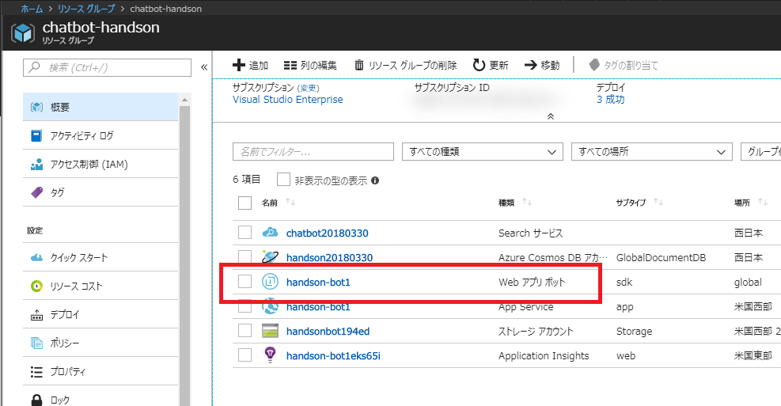
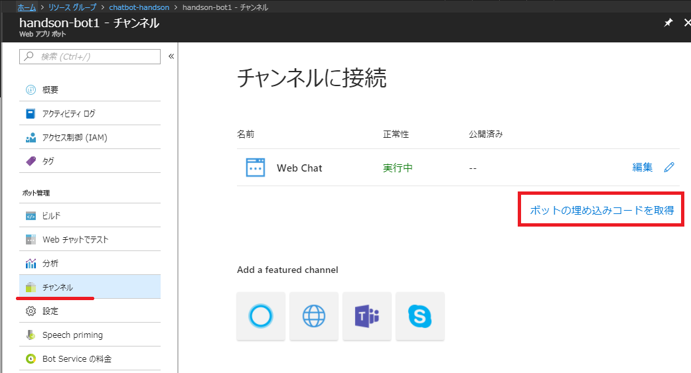
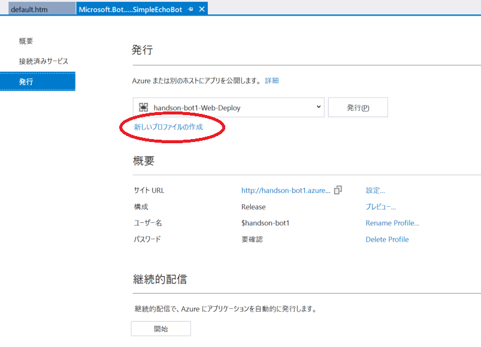
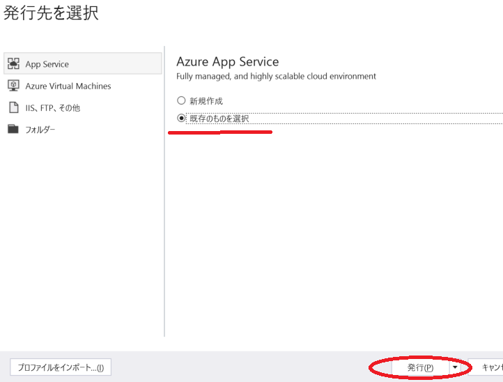
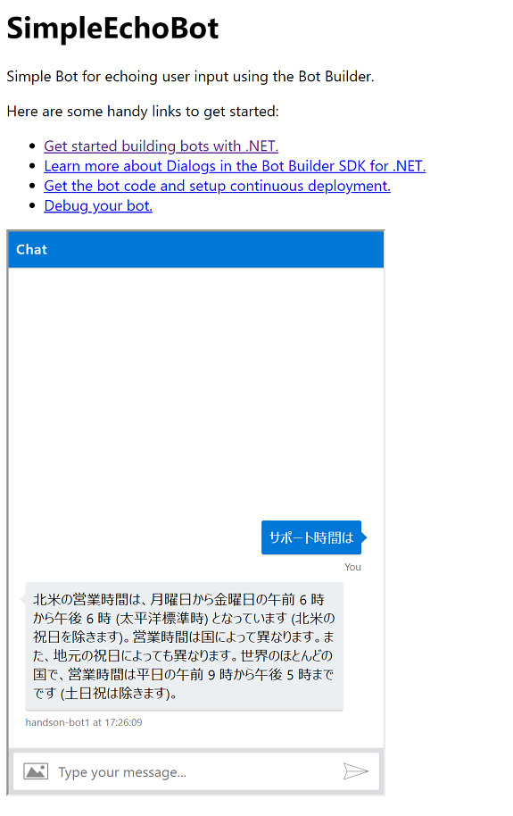

# Azure Bot Service へ発行

開発したチャットボットを Azure Bot Service へ発行しアクセスしてみます。

## Web Chat の UI を実装

Azure に発行した際に、Emulator でアクセスするのではなく、デフォルトで用意されている Web チャットの UI を使ってみましょう。

### 埋め込みコードの取得

Azure ポータルでリソースグループにアクセスし、Web アプリ ボットを開きます。

 

**チャンネル** > **ボットの埋め込みコードを取得** をクリックします。

 

> 「Web Chat の構成ページを開くには、ここをクリックします 」と表示された場合は、クリックします。

シークレットキーと埋め込みコードをコピーしておきましょう。

### プログラムに実装

Visual Studio で `default.htm` を開き先ほど取得した埋め込みコードをBody 内の最下部へ貼り付けます。

また、デフォルトだと高さが短いので、`iframe` 内で適当な高さを指定しておきます。

```html
 <iframe style="width: 400px; height: 600px;" src='https://..以降略
```

## 発行

### 発行プロファイルの作成

Visual Studio から Azure Bot Service へ発行しアクセスします。ソリューションエクスプローラーでプロジェクト名を右クリック > **発行** をクリックします。

> デフォルトでは、発行プロファイルに発行に必要なパスワードがセットされていないため、Azure ポータルから取得する必要があります。  
> 発行プロファイルを作り直して自動で情報を取得してくる方が、オペレーションが簡易のため今回は発行プロファイルを作り直します。

**新しいプロファイルの作成** をクリックします。

 

今回柵下 Web アプリ ボット を選択して **OK** をクリックすると、自動で発行プロファイルを取得して発行が開始されます。

 


発行が正常に終わると、出力ウインドウで「発行に成功しました」と表示され、ブラウザーで `default.htm` の内容が表示されます。
動作確認をしてみましょう。以下のような UI でチャットができます。

 

---

[Back](05_Implement_Search.md) | [Next](99_Challenge.md)