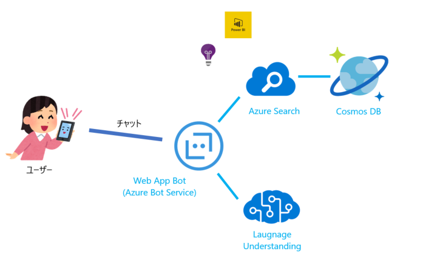

# Azure Search を活用したインテリジェントなチャットボット開発

## ハンズオンのゴール

このハンズオンでは、以下を理解することをゴールとしています。

- Azure Bot Service をプラットフォームとしたチャットボットを構築を理解する
- Azure Search の高度な検索機能を活用した FAQ チャットボットの開発を理解する

## 前提

このハンズオンは、Windows 環境 / Visual Studio 2017 / C# での開発になります。

## 概要

[Azure サポートに関する FAQ サイト](https://azure.microsoft.com/ja-jp/support/faq/) の内容を回答できるチャットボットを開発します。
Azure Search による高度な検索エクスペリメントを活用して、自然言語処理を行い、ユーザーからの質問に回答します。

- FAQ の質問と回答のペアのデータは、Cosmos DB に格納します。
- Azure Bot Service 上にチャットボットを公開し、世界中から利用できるようにします。
- Azure Search の高度な検索エクスペリメントを活用して、ユーザーの質問に回答します。

 

## ハンズオンの構成

|セクション|概要|
|--|--|
|[00_Preparation.md](00_Preparation.md)|開発に必要な環境をセットアップします。|
|[01_Create_CosmosDb.md](01_Create_CosmosDb.md)|Azure ポータルで Cosmos DB を作成し、データをインポートします。|
|[02_Create_AzureSearch.md](02_Create_AzureSearch.md)|Azure ポータルで Azure Search を作成します。|
|[03_Create_AzureBotService.md](03_Create_AzureBotService.md)|Azure ポータルで Azure Bot Service を作成します。|
|[04_Debug_EchoBot.md](04_Debug_EchoBot.md)|Azure ポータルからソースコードをダウンロードし、デバッグできるようにします。| 
|[05_Implement_Search.md](05_Implement_Search.md)|Azure Serach で検索する機能を実装します。|
|[06_Publish](06_Publish)|開発したチャットボットを Azure Bot Service 上に発行し、利用できるようにします。|
|[チャレンジ](99_Challenge.md)|時間が余った方は、課題にチャレンジしましょう！|

---

[準備から始めましょう！](00_Preparation.md)